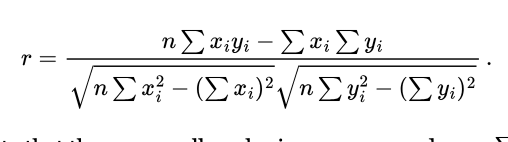
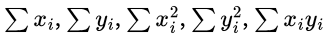

# Exercise 11
As usual, **you may not write any loops** and **all calculations must be done with Spark DataFrames** except where noted below.
## Reddit Relative Scores
Last week, we determined the average score in each subreddit in part of the Reddit Comment Corpus. This week, we want to determine the author of the “best” comment in each subreddit.

We'll define “best” here as the comment with highest score relative to the average. That is, if a subreddit average score is 2.3 and a particular comment has score 4, then the relative score is 4/2.3 = 1.74.

To get there:
1. Calculate the average score for each subreddit, as before.
2. Exclude any subreddits with average score ≤0.
3. Join the average score to the collection of all comments. Divide to get the relative score.
4. Determine the max relative score for each subreddit.
5. Join again to get the best comment on each subreddit: we need this step to get the author. 

Write a program `reddit_relative.py` that takes an input directory and output directory on the command line. Output should be uncompressed JSON (as in the hint) with the fields subreddit, author, (from the original data) and rel_score (calculated as above).

Have a look at your code to make sure you used `.cache()` on any DataFrame that is used more than once.

Just to make sure we're all getting the same values before continuing, on the `reddit-1` data set my output is:
```
{"subreddit":"Cameras","author":"TogOfStills","rel_score":1.6363636363636362}
{"subreddit":"Cameras","author":"[deleted]","rel_score":1.6363636363636362}
{"subreddit":"xkcd","author":"shigawire","rel_score":63.15262594902032}
{"subreddit":"Genealogy","author":"ackbar420","rel_score":6.412607449856734}
{"subreddit":"scala","author":"TheSmoke","rel_score":8.813134009610252}
{"subreddit":"optometry","author":"Klinefelter","rel_score":4.081081081081082}
```
## JOIN timing
There are two `.join()` operations necessary to complete the above. In both cases, one side of the join had one row per subreddit (give-or-take a few ties), so it was small. This is the perfect candidate for a broadcast join.

You can run the program in small groups if you like, but your code and answers below should be written separately. Please run with a command like this: it will limit you to 8 executors, so you have a better chance of getting a fair timing, even if other students are doing this on the cluster at the same time.

```
spark-submit --conf spark.dynamicAllocation.enabled=false --num-executors=8 reddit_relative.py /courses/353/reddit-3 output
```

Try your program on the `reddit-3` data set (≈800MB) on the cluster, **with and without** broadcasting the smaller DataFrame.

* with [broadcast()](https://spark.apache.org/docs/3.1.2/api/python/reference/api/pyspark.sql.functions.broadcast.html)
* without `broadcast()` and adding this to the command line to prevent Spark's automatic broadcasting from doing it anyway: `--conf spark.sql.autoBroadcastJoinThreshold=-1 `

How did the broadcast join affect the running time? (… either measured with the `time` command as last week, or the running time in the YARN frontend.) Give your answers in `answers.txt` as described below.

## Server Log Correlation
One common source of “big data” that you might run across: [web log files](https://en.wikipedia.org/wiki/Web_log_analysis_software). These are generally text files (but could be some other data store) containing a record for every request made to a web server: that can add up quickly for a high-volume service.

There is valuable information in those logs. That causes two things: (1) analysing log files is a common task, but (2) nobody wants to give out their web logs because of privacy and/or secrecy reasons. The best public source of web logs we have is [some NASA logs from 1995](https://ita.ee.lbl.gov/html/contrib/NASA-HTTP.html), so we'll use those. [`nasa-logs-1` is a subset of them; `nasa-logs-2` is the whole set.]

Here is a theory: It could be that in our web server logs, the number of bytes transferred to a host might be correlated with the number of requests the host makes.

In order to check this theory, we would like to calculate the [correlation coefficient](https://en.wikipedia.org/wiki/Pearson_product-moment_correlation_coefficient#For_a_sample) of each host's number of requests and total bytes transferred (which is not exactly a complete statistical analysis, but will be enough to convince us we can do calculations on this data: calculating other stuff won't add much except busy work).

That is, each host making requests will contribute a data point (x,y) where x is the number of requests made by that host, and y is the number of bytes transferred in those requests. Then the correlation coefficient can be calculated as, 

The formula looks bad, but note that there are really only six sums we need: n =  Σ1 (the number of data points), 

That implies an algorithm like:
1. Get the data out of the files into a DataFrame where you have the hostname and number of bytes for each request. Do this using an RDD operation: see hints below.
2. Group by hostname; get the number of requests and sum of bytes transferred, to form a data point `(count_requests, sum_request_bytes) = (xi, yi)
3. Produce six values: 1, xi, xi^2, yi, yi^2, xiyi. Add these to get the 6 sums
4. Calculate the final value of r.

Write a Spark program `correlate_logs.py` that loads the logs from the input files and calculates the correlation coefficient as described above (**not** using the built-in function, but you're welcome to check your results with that function). Take an argument for the **input directory only**.

Our output here is really just the value for r: it doesn't make sense to turn that into an HDFS file. When you have calculated a value for r, `print` two lines with r and r^2 like this (as in the hint code, values here for the larger data set):
```
r = 0.928466
r^2 = 0.862048
```

### Hints
Getting the original log file lines into a DataFrame is tricky. The provided `correlate_logs_hint.py` contains a regular expression that will get the two parts we really need: the hostname (group 1) and the number of bytes transferred (group 2). There are a few lines in the inputs that do not match this regular expression: they shouldn't be included in the analysis.

Write a function that takes one line and returns a `Row` object with the two values you need. Use the RDD `.map()` method to apply it to each line and `.filter` to get rid of the non-matching lines. Then spark.createDataFrame can build a DataFrame from the resulting RDD. (`correlate_logs_hint.py` contains a skeleton of how to put this together.)

To produce “the six sums”, you can call `.groupBy()` with no arguments to aggregate the entire DataFrame to one row.

To get the six floats out of the now-single-row DataFrame, you can call `.first()` to retrieve the one row to the driver process. It will be a tuple of six values. Then it's just a matter of doing a non-Spark Python calculation for r and printing the result.

## Questions
Answer these questions in a file `answers.txt`.
1. In your reddit_relative.py, what intermediate results did you `.cache()`? Briefly describe what would have happened if you hadn't used `.cache()` anywhere. (No need to time it, unless you really want to.)
2. How did marking DataFrames for broadcast affect the running time of the “best author” program above? 